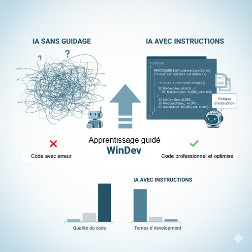

# IA-Windev-2025
L'article montre comment une IA, initialement peu compétente en WLangage, peut produire un code de qualité professionnelle grâce à des fichiers d'instruction précis. Comparatif à l'appui, il démontre l'intérêt d'encadrer la génération IA pour les projets WinDev.

https://www.isineva.com/qualite-du-code-wlangage-genere-par-ia/

